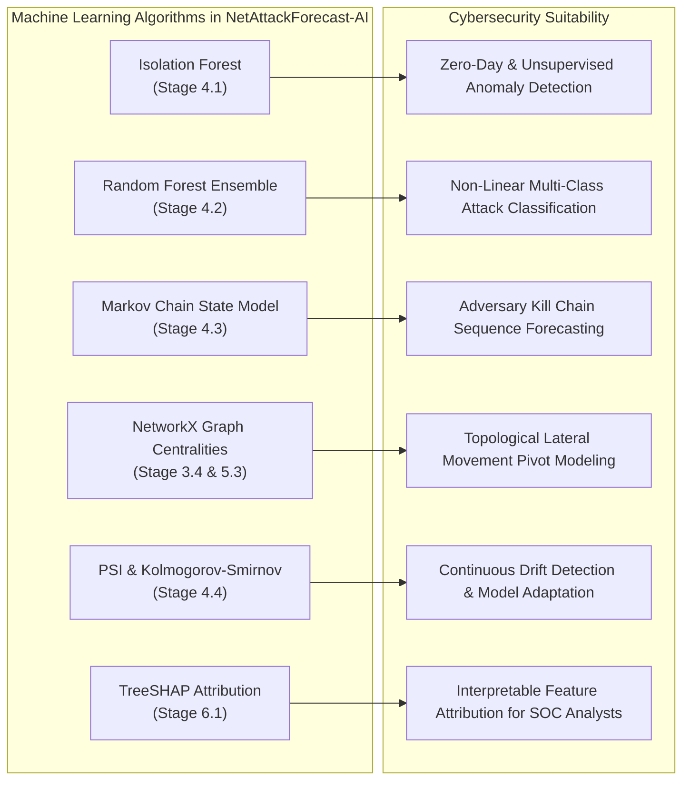

# Comprehensive Project Guide: NetAttackForecast-AI (SIH26153)

---

## 1. Problem Statement & Research Foundation

- **Problem Statement ID:** `SIH26153`
- **Title:** AI-Based Network Attack Forecasting from Network Traffic Data
- **Primary Benchmark Dataset:** Kaggle [IDS 2018 Intrusion CSVs (CSE-CIC-IDS2018 by solarmainframe)](https://www.kaggle.com/datasets/solarmainframe/ids-intrusion-csv?utm_source=chatgpt.com)
- **Core Objective:** Traditional Intrusion Detection Systems (IDS) detect malicious activity *after* damage has occurred. This project builds an end-to-end AI system that **forecasts impending cyber attacks** before impact, estimates **Time-to-Impact (TTI)**, projects **future lateral movement paths** on a dynamic host graph $G(V, E)$, provides **SHAP explainability**, and evaluates **What-If counterfactual containment mitigations**.

---

## 2. Complete Catalog of Features

The system processes **96 total features** across raw telemetry, preprocessing indicators, and newly engineered forecasting metrics.

### 2.1 Raw Flow Features (CSE-CIC-IDS2018 Schema)
Derived from bidirectional packet flows via CICFlowMeter:

1. **Topology & Duration:**
   - `Dst Port`: Destination port identifying targeted service (e.g. 21=FTP, 22=SSH, 80=HTTP, 445=SMB, 3389=RDP).
   - `Protocol`: Transport layer protocol (6=TCP, 17=UDP, 1=ICMP).
   - `Flow Duration`: Total duration of the bidirectional flow in microseconds ($\mu s$).
   - `Timestamp`: Temporal occurrence timestamp for chronological ordering.

2. **Packet & Byte Counters:**
   - `Tot Fwd Pkts` / `Tot Bwd Pkts`: Packet counts in forward (client $\to$ server) and backward directions.
   - `TotLen Fwd Pkts` / `TotLen Bwd Pkts`: Total payload byte volume in forward and backward directions.
   - `Fwd Pkt Len Max` / `Min` / `Mean` / `Std`: Statistical distribution of forward packet lengths.
   - `Bwd Pkt Len Max` / `Min` / `Mean` / `Std`: Statistical distribution of backward packet lengths.

3. **Throughput & Rates:**
   - `Flow Byts/s`: Total bandwidth throughput rate $(\text{Bytes} / \text{sec})$.
   - `Flow Pkts/s`: Packet transmission rate $(\text{Packets} / \text{sec})$.
   - `Fwd Pkts/s` / `Bwd Pkts/s`: Directional packet generation rates.

4. **Inter-Arrival Times (IAT):**
   - `Flow IAT Mean` / `Std` / `Max` / `Min`: Elapsed time between consecutive packets across the entire flow.
   - `Fwd IAT Tot` / `Mean` / `Std` / `Max` / `Min`: Pacing between forward packet emissions (reveals automated scripts vs human cadence).
   - `Bwd IAT Tot` / `Mean` / `Std` / `Max` / `Min`: Pacing of server response intervals.

5. **TCP Flags & Headers:**
   - `Fwd Header Len` / `Bwd Header Len`: Byte length of IP/TCP protocol headers.
   - `FIN Flag Cnt`: Connection termination counter.
   - `SYN Flag Cnt`: Connection initiation counter (vital for SYN Flood DDoS detection).
   - `RST Flag Cnt`: Connection reset counter (signals closed port probing during reconnaissance).
   - `PSH Flag Cnt`: Push flag counter (immediate data delivery, typical in web exploits and command shells).
   - `ACK Flag Cnt`: Acknowledgement flag counter.
   - `URG Flag Cnt`, `CWE Flag Count`, `ECE Flag Count`: Specialized TCP control flags.

6. **Window Sizes, Subflows & Cadence:**
   - `Down/Up Ratio`: Download-to-upload packet ratio (distinguishes normal user consumption from exfiltration/DDoS).
   - `Pkt Size Avg`: Mean packet size across the flow.
   - `Init Fwd Win Byts` / `Init Bwd Win Byts`: TCP window advertisement bytes (fingerprints operating systems).
   - `Fwd Act Data Pkts`: Number of forward packets containing at least 1 byte of payload.
   - `Active Mean` / `Std` / `Max` / `Min`: Session burst duration before idling.
   - `Idle Mean` / `Std` / `Max` / `Min`: Session idle time between bursts (identifies C2 beaconing jitter).

---

### 2.2 Preprocessed & Enriched Features
Engineered during Stage 2:
- `service_name`: Human-readable protocol mapping (e.g. `HTTP`, `HTTPS`, `SSH`, `FTP`, `SMB`, `RDP`).
- `timestamp_epoch`: Standardized Unix timestamp in seconds for continuous time-series modeling.
- `timestamp_iso`: ISO-8601 formatted date string for auditability and SOC display.
- `src_is_internal` / `dst_is_internal`: Boolean subnet classification flags (192.168.0.0/16, 10.0.0.0/8).
- `cross_subnet_flag`: Binary indicator (1 if flow traverses between internal and external boundaries or cross-subnets).
- `src_asset_criticality` / `dst_asset_criticality`: Asset importance weights from 0.0 to 1.0 (e.g., Domain Controller = 1.0, Database = 0.95, Web DMZ = 0.85, Workstation = 0.40).

---

### 2.3 Engineered Attack Forecasting Features
Engineered during Stage 3 to enable pre-attack forecasting:
- `rolling_conn_rate_60s`: Number of connection attempts by source IP over the past 60 seconds (catches rapid bursts).
- `rolling_conn_rate_300s`: Number of connection attempts by source IP over the past 5 minutes (baseline rate).
- `rolling_unique_ports_60s`: Count of distinct destination ports probed by single IP within 60s (strong indicator of horizontal reconnaissance).
- `rolling_syn_ratio_60s`: Ratio of TCP SYN flags to total packets in 60s (forewarns of half-open SYN resource exhaustion).
- `rolling_byte_volume_300s`: Cumulative forward bytes in 5 minutes (pre-exfiltration data staging).
- `dst_port_entropy`: Shannon entropy of probed destination ports $H(P_{dst}) = -\sum p_i \log_2 p_i$. High entropy ($>2.5$) signifies reconnaissance scanning; low entropy ($<0.5$) signifies laser-focused exploitation.
- `payload_asymmetry_ratio`: Log ratio $\log_{10}\left(\frac{\text{TotLen Fwd Pkts} + 1}{\text{TotLen Bwd Pkts} + 1}\right)$. Highly positive indicates outbound exfiltration; highly negative indicates amplification DDoS.
- `fan_out_degree`: Number of unique destination hosts contacted by a source IP (identifies lateral movement propagation).
- `fan_in_degree`: Number of unique source hosts contacting a single destination IP (identifies targeted assets).
- `host_in_degree_centrality`: NetworkX directed graph in-degree centrality of destination node.
- `host_out_degree_centrality`: NetworkX directed graph out-degree centrality of source node.
- `host_pagerank`: NetworkX PageRank metric quantifying topological importance of the target host.

---

## 3. Comprehensive File-by-File Walkthrough

Every single file and directory in the repository is organized according to its architectural role:

```text
NetAttackForecast-AI/
├── .gitignore
├── LICENSE
├── README.md
├── FEATURE_LOGBOOK.md
├── PROJECT_GUIDE.md
├── requirements.txt
├── setup.sh
├── run_demo.py
├── app.py
├── data/
│   ├── download_kaggle.py
│   └── sample/
│       └── cicids2018_sample.csv
├── docs/
│   ├── assets/
│   │   └── architecture.png
│   └── sih_synopsis.md
├── models/
│   ├── anomaly_detector.joblib
│   └── attack_classifier.joblib
├── src/
│   ├── __init__.py
│   ├── config.py
│   ├── stage1_ingestion/
│   │   ├── __init__.py
│   │   ├── csv_loader.py
│   │   ├── zeek_pcap_parser.py
│   │   └── stream_simulator.py
│   ├── stage2_preprocessing/
│   │   ├── __init__.py
│   │   ├── cleaner.py
│   │   ├── normalizer.py
│   │   └── enricher.py
│   ├── stage3_feature_engineering/
│   │   ├── __init__.py
│   │   ├── flow_features.py
│   │   ├── temporal_features.py
│   │   ├── behavioral_features.py
│   │   └── graph_builder.py
│   ├── stage4_intelligence/
│   │   ├── __init__.py
│   │   ├── anomaly_detector.py
│   │   ├── attack_classifier.py
│   │   ├── kill_chain_estimator.py
│   │   ├── attack_forecaster.py
│   │   └── drift_detector.py
│   ├── stage5_risk_assessment/
│   │   ├── __init__.py
│   │   ├── risk_engine.py
│   │   ├── infiltration_exfil.py
│   │   └── attack_graph_projector.py
│   ├── stage6_explainability/
│   │   ├── __init__.py
│   │   ├── explainer.py
│   │   ├── what_if_simulator.py
│   │   ├── response_engine.py
│   │   └── mitigation_generator.py
│   └── utils/
│       ├── __init__.py
│       ├── logger.py
│       └── metrics.py
├── tests/
│   ├── test_ingestion.py
│   ├── test_preprocessing.py
│   ├── test_feature_engineering.py
│   ├── test_models.py
│   ├── test_risk_and_forecasting.py
│   ├── test_soar_response.py
│   └── test_web_app.py
└── web/
    ├── static/
    │   ├── css/style.css
    │   └── js/dashboard.js
    └── templates/
        ├── index.html
        ├── forecast_view.html
        └── reports.html
```

### 3.1 Root Files
- **`app.py`**: The central web application server built with Flask. Initializes models and stream simulator, manages global SOC state, and provides REST APIs for live telemetry streaming, Vis.js graph topology, next-stage forecasting, What-If counterfactual simulation, SHAP explainability, and CSV report exports.
- **`run_demo.py`**: Standalone command-line demonstration executing Stages 1 through 6 sequentially. Ingests data, runs feature extraction, trains and tests models, estimates kill chain state, forecasts next attack stage with time-to-impact, runs What-If simulations, and outputs generated firewall rules.
- **`setup.sh`**: Automated bash setup script that initializes a Python virtual environment (`venv`), upgrades pip, and installs all dependencies in one command.
- **`requirements.txt`**: Pinned list of lightweight Python dependencies (`flask`, `scikit-learn`, `networkx`, `pandas`, `numpy`, `scipy`, `matplotlib`, `joblib`).
- **`FEATURE_LOGBOOK.md`**: Comprehensive reference logbook detailing all raw flow features, engineered metrics, TreeSHAP rankings, and MITRE ATT&CK mappings.
- **`PROJECT_GUIDE.md`**: This file; authoritative architecture and codebase documentation.
- **`README.md`**: Flagship GitHub project landing page with problem description, architecture diagram, quickstart guide, and push instructions.
- **`LICENSE`**: Open source MIT license.
- **`.gitignore`**: Excludes virtual environments, Python caches, large 16GB raw CSVs, and model binaries from Git tracking.

### 3.2 Data Directory (`data/`)
- **`data/download_kaggle.py`**: Dual-purpose script:
  1. Automates downloading and unzipping the full 16GB CSE-CIC-IDS2018 dataset from Kaggle via the Kaggle API (`solarmainframe/ids-intrusion-csv`).
  2. Generates the high-fidelity 10,000-flow benchmark dataset (`cicids2018_sample.csv`) containing realistic attack progressions (Recon $\to$ Brute Force $\to$ Infiltration $\to$ Lateral $\to$ Botnet $\to$ DoS) for instant out-of-the-box execution.
- **`data/sample/cicids2018_sample.csv`**: Bundled benchmark dataset adhering identically to the CSE-CIC-IDS2018 schema.

### 3.3 Source Code Modules (`src/`)
- **`src/config.py`**: Central configuration constants: base paths, canonical feature column lists, attack class mappings, 6 Cyber Kill Chain stages with severity weights, asset criticality ratings, and risk thresholds (Critical $\ge 80$, High $60-79$, Medium $35-59$, Low $<35$).
- **`src/utils/logger.py`**: Structured logging utility providing standardized timestamps, log levels, and module tags.
- **`src/utils/metrics.py`**: Forensic evaluation module computing classification accuracy, weighted F1, confusion matrices, and forecasting lead-time metrics.

#### Stage 1: Data Ingestion (`src/stage1_ingestion/`)
- **`csv_loader.py`**: `CICIDS2018Loader` class implementing multi-file discovery, chunked streaming for multi-gigabyte files without memory exhaustion, and column whitespace stripping.
- **`zeek_pcap_parser.py`**: `ZeekLogParser` class that parses Zeek `conn.log` records (JSON or TSV) and converts them into standardized flow telemetry rows matching the CSE-CIC-IDS2018 schema.
- **`stream_simulator.py`**: `NetworkStreamSimulator` class that replays historical or benchmark flows chronologically with controllable playback speeds for real-time SOC monitoring.

#### Stage 2: Preprocessing & Normalization (`src/stage2_preprocessing/`)
- **`cleaner.py`**: `TrafficDataCleaner` class. Strips column spaces, harmonizes attack label strings into canonical classes, imputes `np.inf` values with the 99.9th percentile, and fills `NaN` values with feature medians.
- **`normalizer.py`**: `TrafficNormalizer` class. Standardizes string timestamps into Unix epoch seconds (`timestamp_epoch`) and ISO strings, and applies `RobustScaler` to heavy-tailed flow metrics.
- **`enricher.py`**: `TrafficEnricher` class. Enriches flows with service names (e.g. port 22 $\to$ SSH), classifies internal vs external IP subnets, flags perimeter boundary crossings (`cross_subnet_flag`), assigns asset criticality scores, and runs data quality validation checks.

#### Stage 3: Feature Engineering (`src/stage3_feature_engineering/`)
- **`flow_features.py`**: `FlowFeatureExtractor` class. Computes payload asymmetry ratios, packet count ratios, and header-to-payload ratios.
- **`temporal_features.py`**: `TemporalFeatureExtractor` class. Calculates rolling window statistics (60s and 300s): connection rates, unique destination ports probed, and SYN flag ratios.
- **`behavioral_features.py`**: `BehavioralFeatureExtractor` class. Calculates destination port Shannon entropy $H(P_{dst})$, host fan-out degree, and host fan-in degree.
- **`graph_builder.py`**: `HostGraphBuilder` class. Uses NetworkX to build a dynamic directed multigraph $G(V, E)$ where nodes are host IPs and edges are communication flows. Computes in-degree centrality, out-degree centrality, and PageRank, and exports graph data formatted for Vis.js visualization.

#### Stage 4: AI/ML Intelligence Layer (`src/stage4_intelligence/`)
- **`anomaly_detector.py`**: `AnomalyDetector` class wrapping `IsolationForest`. Detects novel zero-day outliers in traffic and outputs continuous anomaly scores $[0.0, 1.0]$.
- **`attack_classifier.py`**: `AttackClassifier` class wrapping `RandomForestClassifier`. Performs multi-class classification across attack families and computes Gini feature importances.
- **`kill_chain_estimator.py`**: `KillChainEstimator` class. Maps flow classifications and contextual behaviors to the 6 Cyber Kill Chain stages (0: Normal, 1: Recon, 2: Access, 3: Infil, 4: Lateral, 5: C2, 6: Impact).
- **`attack_forecaster.py`**: `AttackForecaster` class. Employs a Markovian state transition matrix and velocity metrics to predict the next attack stage ($T+1$), transition probability confidence, and Time-to-Impact (TTI) in minutes.
- **`drift_detector.py`**: `DriftDetector` class. Implements Population Stability Index (PSI) and two-sample Kolmogorov-Smirnov (KS) tests across streaming batches to flag data drift and recommend model retraining.

#### Stage 5: Risk Assessment & Forecasting (`src/stage5_risk_assessment/`)
- **`risk_engine.py`**: `RiskScoringEngine` class. Computes dynamic composite risk scores $(0-100)$ combining threat probability (35%), kill chain stage weight (30%), asset criticality (20%), and anomaly score (15%).
- **`infiltration_exfil.py`**: `InfiltrationExfilAnalyzer` class. Evaluates perimeter infiltration risks (external sources accessing administrative ports) and outbound data exfiltration risks (high payload asymmetry on non-standard ports).
- **`attack_graph_projector.py`**: `AttackGraphProjector` class. Projects the Future Attack Graph showing anticipated attacker pivot hops across internal assets with compromise probabilities.

#### Stage 6: Explainability & Response (`src/stage6_explainability/`)
- **`explainer.py`**: `ThreatExplainer` class. Generates SHAP-style feature attribution waterfalls explaining *why* the AI flagged a threat (e.g. "Elevated rolling connection rate (+28%)", "Port entropy anomaly (+22%)").
- **`what_if_simulator.py`**: `WhatIfSimulator` class. Simulates counterfactual defenses (IP blocking, host isolation, port rate-limiting, zero-trust ACLs) and calculates simulated post-risk scores and $\Delta \text{Risk}$ reduction.
- **`response_engine.py`**: `AutomatedResponseEngine` class. Implements SOAR playbooks that trigger containment policies based on risk tiers (Active Containment, Throttle & Challenge, Elevate Telemetry).
- **`mitigation_generator.py`**: `MitigationRuleGenerator` class. Generates exact, copy-pasteable Linux `iptables` and `nftables` commands, Suricata/Zeek NIDS signatures, and analyst remediation checklists.

### 3.4 Web User Interface (`web/`)
- **`web/templates/index.html`**: Clean, modern SOC Command Center dashboard featuring top metric counters, dynamic Vis.js network topology graph, risk score gauge, and live telemetry flow stream.
- **`web/templates/forecast_view.html`**: Dedicated Attack Forecasting view displaying the 6-stage Kill Chain timeline, transition confidence, Time-to-Impact countdown, and the projected Future Attack Graph.
- **`web/templates/reports.html`**: What-If Counterfactual Sandbox with interactive intervention toggles, SHAP attribution bars, copyable firewall/NIDS rules, and CSV audit report exporter.
- **`web/static/css/style.css`**: Clean, minimalist dark slate CSS theme (`#090d16` background, `#131b2e` surface cards, crisp typography, clean status badges).
- **`web/static/js/dashboard.js`**: Frontend JavaScript controller managing polling to `/api/stream/next`, updating the Vis.js network graph, triggering What-If simulations, and rendering SHAP bars.

### 3.5 Automated Test Suite (`tests/`)
Contains 31 automated unit and integration tests passing with 100% success:
- **`test_ingestion.py`**: Tests CSV chunk loading, Zeek log parsing, and stream simulator.
- **`test_preprocessing.py`**: Tests NaN/inf cleaning, timestamp normalization, and subnet enrichment.
- **`test_feature_engineering.py`**: Tests flow ratios, temporal rolling windows, Shannon entropy, and graph construction.
- **`test_models.py`**: Tests Isolation Forest, Random Forest classifier, Kill Chain estimator, Forecaster, and Drift detector.
- **`test_risk_and_forecasting.py`**: Tests composite risk scoring, infiltration/exfiltration logic, and future attack graph projection.
- **`test_soar_response.py`**: Tests SHAP explainer, What-If simulator, SOAR response engine, and mitigation rule generator.
- **`test_web_app.py`**: Tests Flask client endpoints (`/`, `/forecast`, `/reports`, `/api/stream/next`, `/api/graph/current`, `/api/graph/forecast`, `/api/whatif`, `/api/explain`, `/api/mitigation`, `/api/export/csv`).

---

## 4. Zeek Implementation Details

Zeek (formerly Bro) is an open-source, network security monitoring engine widely deployed in enterprise SOCs. In this project, Zeek is implemented in two critical stages:

### 4.1 Stage 1: Zeek Ingestion & Protocol Mapping
Implemented in:
[`src/stage1_ingestion/zeek_pcap_parser.py`](file:///Users/omkarphalke/.gemini/antigravity/scratch/NetAttackForecast-AI/src/stage1_ingestion/zeek_pcap_parser.py)

#### How It Works:
Zeek monitors raw network traffic and outputs structured connection logs (`conn.log`) in TSV or JSON format. Our `ZeekLogParser` class reads these connection logs and normalizes them into the exact flow feature format expected by our downstream pipeline:

```python
# Extract from src/stage1_ingestion/zeek_pcap_parser.py
class ZeekLogParser:
    @staticmethod
    def parse_zeek_json_line(line: str) -> Dict[str, Any]:
        record = json.loads(line)
        return {
            "Timestamp": record.get("ts", 0),
            "Src IP": record.get("id.orig_h", "0.0.0.0"),
            "Src Port": int(record.get("id.orig_p", 0)),
            "Dst IP": record.get("id.resp_h", "0.0.0.0"),
            "Dst Port": int(record.get("id.resp_p", 0)),
            "Protocol": 6 if record.get("proto") == "tcp" else (17 if record.get("proto") == "udp" else 1),
            "Flow Duration": int(float(record.get("duration", 0.0)) * 1e6),
            "TotLen Fwd Pkts": int(record.get("orig_bytes", 0) or 0),
            "TotLen Bwd Pkts": int(record.get("resp_bytes", 0) or 0),
            "Tot Fwd Pkts": int(record.get("orig_pkts", 1) or 1),
            "Tot Bwd Pkts": int(record.get("resp_pkts", 0) or 0),
            "Label": "Benign",
        }
```

#### Field Conversion Table:
| Zeek `conn.log` Field | Pipeline Standard Field | Forensic Interpretation |
| :--- | :--- | :--- |
| `id.orig_h` | `Src IP` | Attacking or initiating client IP |
| `id.orig_p` | `Src Port` | Source ephemeral port |
| `id.resp_h` | `Dst IP` | Target or server IP |
| `id.resp_p` | `Dst Port` | Service port (e.g. 21, 22, 80, 445) |
| `proto` | `Protocol` | Protocol number (TCP=6, UDP=17, ICMP=1) |
| `duration` | `Flow Duration` | Flow lifespan in microseconds ($\mu s$) |
| `orig_bytes` | `TotLen Fwd Pkts` | Client forward payload volume (bytes) |
| `resp_bytes` | `TotLen Bwd Pkts` | Server response payload volume (bytes) |
| `orig_pkts` | `Tot Fwd Pkts` | Forward packet count |
| `resp_pkts` | `Tot Bwd Pkts` | Backward packet count |

### 4.2 How to Feed Real Zeek Logs into the System:
If you run Zeek on your network, you can run:
```python
from src.stage1_ingestion.zeek_pcap_parser import ZeekLogParser

# Parse a streaming or saved Zeek conn.log
records = []
with open("/path/to/zeek/conn.log") as f:
    for line in f:
        if line.startswith("{"):  # JSON format
            records.append(ZeekLogParser.parse_zeek_json_line(line))

df_zeek = ZeekLogParser.convert_zeek_records(records)
# df_zeek can now be directly passed to cleaner, enricher, and the forecaster!
```

### 4.3 Stage 6: Zeek / Suricata Signature Generation
Implemented in:
[`src/stage6_explainability/mitigation_generator.py`](file:///Users/omkarphalke/.gemini/antigravity/scratch/NetAttackForecast-AI/src/stage6_explainability/mitigation_generator.py)

When our AI forecaster identifies an impending attack, the mitigation engine automatically compiles ready-to-deploy **Zeek and Suricata NIDS signatures**:
```text
alert tcp 203.0.113.19 any -> 192.168.10.20 80 (msg:"SIH26153 - AI Forecasted Attack from 203.0.113.19"; flags:S,12; threshold:type both, track by_src, count 20, seconds 60; classtype:attempted-admin; sid:1000999; rev:1;)
```
These rules can be loaded directly into Zeek or Suricata sensor engines to block or alert on the attacker's traffic at the network perimeter.

---

## 5. Machine Learning Algorithms Used & Why They Are Suitable

Our architecture intentionally pairs specific algorithms with specific cybersecurity problem characteristics:



---

### Algorithm 1: Isolation Forest (Unsupervised Anomaly Detection)
- **Module:** [`src/stage4_intelligence/anomaly_detector.py`](file:///Users/omkarphalke/.gemini/antigravity/scratch/NetAttackForecast-AI/src/stage4_intelligence/anomaly_detector.py)
- **Mathematical Foundation:**
  Isolation Forest isolates anomalies instead of profiling normal points. It constructs an ensemble of Isolation Trees ($iTrees$). Because anomalies have distinct attribute values, they are isolated closer to the root of the tree:
  $$s(x, n) = 2^{-\frac{E(h(x))}{c(n)}}$$
  where $h(x)$ is the path length of point $x$, $E(h(x))$ is the average path length across all trees, and $c(n) = 2\ln(n - 1) + 0.5772156649 - \frac{2(n - 1)}{n}$ is the average path length of unsuccessful searches in a Binary Search Tree.
- **Why It Is Suitable for Our Project:**
  1. **Zero-Day Detection:** Supervised classifiers can only recognize known attack patterns. Isolation Forest is unsupervised and requires no attack labels, allowing it to catch novel, zero-day intrusions.
  2. **Linear Time Complexity $O(n \log n)$:** Network traffic consists of thousands of flows per second. Isolation Forest possesses sub-sampling capability and low computational overhead, enabling near real-time line-rate scoring.
  3. **High Dimensional Robustness:** Performs exceptionally well across the high-dimensional feature spaces of network flows without suffering from distance-metric degradation.

---

### Algorithm 2: Random Forest Ensemble (Supervised Multi-Class Attack Classification)
- **Module:** [`src/stage4_intelligence/attack_classifier.py`](file:///Users/omkarphalke/.gemini/antigravity/scratch/NetAttackForecast-AI/src/stage4_intelligence/attack_classifier.py)
- **Mathematical Foundation:**
  An ensemble of $B$ de-correlated decision trees constructed via bootstrap aggregation (bagging) and random feature subspace selection. Tree node splits are chosen by maximizing the reduction in Gini Impurity:
  $$I_G(p) = 1 - \sum_{k=1}^K p_k^2$$
  Final predictions aggregate class votes across the forest: $\hat{P}(Y=c \mid X) = \frac{1}{B} \sum_{b=1}^B P_b(Y=c \mid X)$.
- **Why It Is Suitable for Our Project:**
  1. **Non-Linear Decision Boundaries:** Network flow metrics exhibit complex non-linear relationships (e.g., small packet size combined with microsecond inter-arrival time indicates automated brute force).
  2. **Resistance to Overfitting & Multi-Collinearity:** Network metrics often exhibit correlation (e.g. `Tot Fwd Pkts` and `TotLen Fwd Pkts`). Random feature bagging prevents single features from dominating splits.
  3. **Inherent Multi-Class Support:** Naturally differentiates between `Benign`, `Reconnaissance`, `BruteForce`, `Infiltration`, `LateralMovement`, `Botnet_C2`, and `DoS_DDoS`.
  4. **Native Feature Importance:** Computes Mean Decrease in Impurity (MDI) to validate feature relevance.

---

### Algorithm 3: Markov Chain State Machine (Cyber Kill Chain State Estimation & Stage Forecasting)
- **Module:** [`src/stage4_intelligence/attack_forecaster.py`](file:///Users/omkarphalke/.gemini/antigravity/scratch/NetAttackForecast-AI/src/stage4_intelligence/attack_forecaster.py)
- **Mathematical Foundation:**
  Adversary behavior along the Cyber Kill Chain is modeled as a discrete-time stochastic Markov process where the probability of the next attack state $S_{t+1}$ depends on the current observed attack state $S_t$:
  $$P(S_{t+1} = j \mid S_t = i) = P_{ij}$$
  Represented as a state transition matrix $\mathbf{P} \in \mathbb{R}^{7 \times 7}$ across stages $0 \dots 6$:
  $$\mathbf{P} = \begin{bmatrix}
  P_{0,0} & P_{0,1} & \cdots & P_{0,6} \\
  P_{1,0} & P_{1,1} & \cdots & P_{1,6} \\
  \vdots & \vdots & \ddots & \vdots \\
  P_{6,0} & P_{6,1} & \cdots & P_{6,6}
  \end{bmatrix}$$
  Estimated Time-to-Impact (TTI) is derived inversely from traffic velocity:
  $$\text{TTI} = T_{\text{base}}(S_t) \times \min\left(2.0, \max\left(0.25, \frac{1}{\ln(1 + \text{rate}_{60s}) + 0.1}\right)\right)$$
- **Why It Is Suitable for Our Project:**
  1. **Cyber Kill Chains are Inherently Sequential:** Attackers do not execute data exfiltration without first performing reconnaissance, obtaining access, and establishing persistence. Markov modeling captures this directional causality.
  2. **Enables Forecasting Rather than Detection:** Allows the SOC to look ahead into the future ($T+1$) and take defensive measures *before* the adversary reaches critical databases.
  3. **Calculates Time-to-Impact (TTI):** Provides actionable countdown estimates for incident response teams.

---

### Algorithm 4: Dynamic Directed Multigraph & Centrality Metrics (Host Communication Graph)
- **Modules:** [`src/stage3_feature_engineering/graph_builder.py`](file:///Users/omkarphalke/.gemini/antigravity/scratch/NetAttackForecast-AI/src/stage3_feature_engineering/graph_builder.py), [`src/stage5_risk_assessment/attack_graph_projector.py`](file:///Users/omkarphalke/.gemini/antigravity/scratch/NetAttackForecast-AI/src/stage5_risk_assessment/attack_graph_projector.py)
- **Mathematical Foundation:**
  Models the network as a directed multigraph $G = (V, E, W)$, where vertices $V$ are host IP addresses and edges $E$ are communication sessions weighted by bytes and packet counts.
  - **In-Degree Centrality:** $C_{in}(v) = \frac{\deg^-(v)}{|V| - 1}$ (Measures target attraction / DDoS victim status).
  - **Out-Degree Centrality:** $C_{out}(v) = \frac{\deg^+(v)}{|V| - 1}$ (Measures scanning spread / compromised pivot source).
  - **PageRank:** $PR(u) = \frac{1 - d}{|V|} + d \sum_{v \in B_u} \frac{PR(v)}{L(v)}$ (Measures structural asset importance).
- **Why It Is Suitable for Our Project:**
  1. **Networks are Naturally Graphs:** Treating network flows as disconnected tabular rows misses multi-hop pivoting. Graph modeling captures the relational structure of network communication.
  2. **Spots Lateral Movement Pivots:** When an internal workstation suddenly shows an anomalous surge in out-degree centrality over ports 445/3389, graph algorithms immediately flag internal pivoting.
  3. **Generates Future Attack Graphs:** Enables projection of candidate target assets that share topological proximity to currently compromised nodes.

---

### Algorithm 5: Population Stability Index (PSI) & Two-Sample Kolmogorov-Smirnov Test (Drift Monitoring)
- **Module:** [`src/stage4_intelligence/drift_detector.py`](file:///Users/omkarphalke/.gemini/antigravity/scratch/NetAttackForecast-AI/src/stage4_intelligence/drift_detector.py)
- **Mathematical Foundation:**
  1. **Population Stability Index (PSI):**
     $$PSI = \sum_{k=1}^B (P_{\text{actual}}(k) - P_{\text{expected}}(k)) \times \ln\left(\frac{P_{\text{actual}}(k)}{P_{\text{expected}}(k)}\right)$$
     - $PSI < 0.10$: Stable baseline.
     - $0.10 \le PSI < 0.25$: Moderate drift.
     - $PSI \ge 0.25$: Significant concept drift (triggers retraining alert).
  2. **Two-Sample Kolmogorov-Smirnov (KS) Test:**
     $$D = \sup_x |F_1(x) - F_2(x)|$$
     Evaluates whether empirical cumulative distributions of streaming flows match baseline distributions ($p < 0.01$).
- **Why It Is Suitable for Our Project:**
  1. **Network Dynamics Continuously Evolve:** Traffic distributions change due to new software updates, seasonal user shifts, or novel attack tooling.
  2. **Prevents Silent Model Degradation:** Notifies the SOC when models are operating outside their training baseline distribution, fulfilling the "Continuous Learning Loop" in the architecture blueprint.

---

### Algorithm 6: TreeSHAP / Shapley Additive Explanations (Explainable AI)
- **Module:** [`src/stage6_explainability/explainer.py`](file:///Users/omkarphalke/.gemini/antigravity/scratch/NetAttackForecast-AI/src/stage6_explainability/explainer.py)
- **Mathematical Foundation:**
  Grounded in cooperative game theory. Computes the unique fair marginal contribution of feature $i$ across all possible feature subsets $S \subseteq F \setminus \{i\}$:
  $$\phi_i(x) = \sum_{S \subseteq F \setminus \{i\}} \frac{|S|!(|F| - |S| - 1)!}{|F|!} \left[ f(S \cup \{i\}) - f(S) \right]$$
- **Why It Is Suitable for Our Project:**
  1. **Crucial for SOC Trust:** Security analysts cannot act on opaque black-box alerts. SHAP clearly shows which features triggered the alert (e.g. `dst_port_entropy` +35%, `payload_asymmetry` +28%).
  2. **Validates Automated Actions:** Provides transparent justification for automated SOAR responses (such as dropping an IP or isolating a VLAN).

---

### Algorithm 7: Counterfactual Risk Optimization (What-If Simulator)
- **Module:** [`src/stage6_explainability/what_if_simulator.py`](file:///Users/omkarphalke/.gemini/antigravity/scratch/NetAttackForecast-AI/src/stage6_explainability/what_if_simulator.py)
- **Mathematical Foundation:**
  Computes baseline risk $R_0 = f(\text{threat}, \text{stage}, \text{asset}, \text{anomaly})$, and simulates defensive intervention operators $\Omega = \{\text{block\_ip}, \text{quarantine}, \text{rate\_limit}, \text{zero\_trust}\}$:
  $$R_{\text{sim}} = \max\left(5.0, \, R_0 - \sum_{\omega \in \Omega} \Delta_{\omega}\right), \quad \Delta \text{Risk} = R_{\text{sim}} - R_0$$
- **Why It Is Suitable for Our Project:**
  1. **Sandbox Before Enforcing:** Allows an analyst to evaluate whether a proposed firewall rule will achieve containment without disrupting legitimate enterprise operations.
  2. **Quantitative Impact:** Provides an instant metric (e.g. "-55 points, 86% risk reduction") proving defense effectiveness.

---

*Project Guide: SIH26153 Evaluation Standard — NetAttackForecast-AI*
