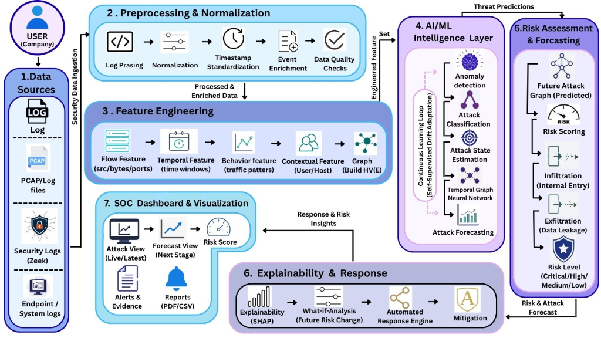

# NetAttackForecast-AI: AI-Based Network Attack Forecasting from Network Traffic Data

[](docs/sih_synopsis.md)
[](https://www.python.org/)
[](https://www.kaggle.com/datasets/solarmainframe/ids-intrusion-csv)
[](LICENSE)
[-emerald?style=for-the-badge&logo=githubactions)](tests/)

---

## 📌 Problem Overview & Core Motivation

- **Smart India Hackathon Problem Statement:** `SIH26153` — *“AI-Based Network Attack Forecasting from Network Traffic Data”*
- **Primary Benchmark Dataset:** [Kaggle IDS 2018 Intrusion CSVs (CSE-CIC-IDS2018)](https://www.kaggle.com/datasets/solarmainframe/ids-intrusion-csv?utm_source=chatgpt.com)

### ⚠️ The Problem with Traditional IDS
Conventional Intrusion Detection Systems (Snort, Suricata, Zeek, static SIEM correlations) are **purely reactive**: they flag an incident only after malicious packets have been received or when systems are already compromised.

### 💡 The Solution: Proactive Multi-Step Attack Forecasting
**NetAttackForecast-AI** shifts network defense from post-incident detection to **pre-incident forecasting**:
- Tracks **temporal rolling windows** ($W_{60s}, W_{300s}$), **destination port Shannon entropy** $H(P_{dst})$, and **payload asymmetry ratios** to identify adversary preparation and scanning.
- Maps observable flows into a 6-stage **Cyber Kill Chain State Machine** (Reconnaissance $\to$ Initial Access $\to$ Infiltration $\to$ Lateral Movement $\to$ C2 $\to$ Exfiltration/DoS).
- Employs a **Temporal Sequence & Markov Forecaster** to predict:
  - **Forecasted Next Attack Stage ($T+1$)**
  - **Transition Probability Confidence**
  - **Estimated Time-to-Impact (TTI in minutes)** before internal assets are breached.
- Constructs a dynamic directed **Host Communication Graph $G(V, E)$** and projects the **Future Attack Graph**, anticipating adversary pivot paths across internal subnets.
- Provides a **What-If Counterfactual Simulation Sandbox** allowing SOC analysts to simulate interventions (blocking IPs, VLAN quarantines, rate limiting) and observe immediate risk reduction ($\Delta \text{Risk}$).

---

## 🏛️ System Architecture

The project strictly follows the 7-stage end-to-end architecture:



### The 7 Pipeline Stages:
1. **Data Sources & Security Ingestion:**
   - Ingests CSE-CIC-IDS2018 flow CSVs, PCAP/Zeek network logs, and real-time streaming telemetry replay.
2. **Preprocessing & Normalization:**
   - Cleans white-space column anomalies, imputes infinities/NaNs, standardizes timestamps into Unix epoch/ISO formats, enriches port-to-service and subnet mappings, and validates zero-loss data quality.
3. **Feature Engineering & Dynamic Host Graph:**
   - Computes flow-level payload asymmetry, temporal sliding rate windows (60s, 300s), Shannon port entropy, fan-in/fan-out ratios, and builds a live directed multigraph $G(V, E)$ with NetworkX computing in/out-degree centrality and PageRank.
4. **AI/ML Intelligence Layer:**
   - **Anomaly Detection:** Unsupervised `IsolationForest` detecting zero-day traffic outliers.
   - **Attack Classification:** Supervised multi-class `RandomForestClassifier` mapping flows to attack categories (`Benign`, `Reconnaissance`, `BruteForce`, `Infiltration`, `LateralMovement`, `Botnet_C2`, `DoS_DDoS`).
   - **Kill Chain State Estimator:** Tracks adversary progression along the cyber kill chain.
   - **Attack Forecaster:** Computes $T+1$ stage transitions, probability confidence, and time-to-impact (TTI).
   - **Continuous Learning Loop:** Monitors distribution drift via Population Stability Index (PSI) and two-sample Kolmogorov-Smirnov (KS) tests.
5. **Risk Assessment & Forecasting:**
   - Computes dynamic composite risk scores ($0 - 100$) combining threat probability, kill chain stage weight, asset criticality, and anomaly signals.
   - Analyzes Infiltration (internal entry) and Exfiltration (data leakage).
   - Projects the **Future Attack Graph** with forecasted compromise pivot hops.
6. **Explainability & Automated Response:**
   - **SHAP Feature Attribution:** Explains *why* the AI flagged a threat (e.g. port entropy burst, high SYN ratio).
   - **What-If Sandbox:** Simulates counterfactual security controls and computes $\Delta \text{Risk}$.
   - **Automated SOAR Engine:** Dispatches containment playbooks based on risk severity.
   - **Mitigation Rule Generator:** Produces copy-paste Linux `iptables`, `nftables`, and Suricata IDS rules.
7. **SOC Dashboard & Visualization:**
   - Interactive dark-mode web command center (Flask + TailwindCSS + Vis.js + Chart.js) with live telemetry stream, real-time risk gauge, network topology graph, and forensic export center.

---

## 📂 Repository Structure

```text
NetAttackForecast-AI/
├── app.py                          # SOC Command Center Web Server (Flask)
├── run_demo.py                     # Standalone CLI Demo executing Stages 1 through 6
├── setup.sh                        # Automated virtualenv setup script
├── requirements.txt                # Python dependencies
├── FEATURE_LOGBOOK.md              # Detailed logbook of all ~80 features & security impact
├── LICENSE                         # MIT License
├── README.md                       # Complete Project Documentation & GitHub Guide
├── docs/
│   ├── assets/
│   │   └── architecture.png        # System architecture diagram
│   └── sih_synopsis.md             # Detailed SIH submission synopsis
├── data/
│   ├── download_kaggle.py          # Kaggle dataset downloader & sample generator
│   └── sample/
│       └── cicids2018_sample.csv   # High-fidelity benchmark sample (10,000 flows)
├── models/
│   ├── anomaly_detector.joblib     # Pre-trained Isolation Forest model
│   └── attack_classifier.joblib    # Pre-trained Multi-Class Random Forest model
├── src/
│   ├── config.py                   # Central settings, features, attack classes, asset weights
│   ├── stage1_ingestion/           # Stage 1: CSV loader, Zeek parser, Stream simulator
│   ├── stage2_preprocessing/       # Stage 2: Cleaner, Normalizer, Enricher
│   ├── stage3_feature_engineering/ # Stage 3: Flow, Temporal, Behavioral, Graph builder
│   ├── stage4_intelligence/        # Stage 4: Anomaly, Classifier, Kill Chain, Forecaster, Drift
│   ├── stage5_risk_assessment/     # Stage 5: Composite Risk, Infiltration/Exfil, Graph projector
│   ├── stage6_explainability/      # Stage 6: SHAP Explainer, What-If, SOAR, Mitigation rules
│   └── utils/                      # Logger & forensic evaluation metrics
├── web/
│   ├── templates/                  # HTML5 Templates (Dashboard, Forecast View, Reports)
│   └── static/                     # CSS & JS (Vis.js network topology controller)
└── tests/                          # Complete automated test suite (21 unit tests)
```

---

## ⚡ Quickstart Guide

### 1. Automated Installation
Clone the repository and run the setup script:
```bash
git clone <your-github-repo-url>
cd NetAttackForecast-AI
chmod +x setup.sh
./setup.sh
```

Or manually:
```bash
python3 -m venv venv
source venv/bin/activate
pip install -r requirements.txt
```

### 2. Run the End-to-End CLI Demo (Stages 1 - 6)
Executes all stages, trains models, evaluates metrics, runs forecasting, and generates mitigations:
```bash
python run_demo.py
```

### 3. Launch the SOC Web Command Center (Stage 7)
Starts the interactive cybersecurity dashboard:
```bash
python app.py
```
Open your browser at: **`http://127.0.0.1:5000`**

- **Live Telemetry & Graph:** `http://127.0.0.1:5000/`
- **Attack Forecaster & Kill Chain View:** `http://127.0.0.1:5000/forecast`
- **What-If Sandbox & Mitigation Rules:** `http://127.0.0.1:5000/reports`

### 4. Run the Automated Test Suite
```bash
python -m unittest discover tests
```

---

## 📊 Feature Logbook (`FEATURE_LOGBOOK.md`)

A comprehensive, production-grade reference logbook is maintained in [`FEATURE_LOGBOOK.md`](FEATURE_LOGBOOK.md) detailing:
1. **Catalog of all 80 raw CSE-CIC-IDS2018 flow metrics** (Flow Duration, Bytes/s, Packets/s, IATs, TCP Flags, Window Sizes, Subflows).
2. **Preprocessing transformations** (Zero-variance elimination, percentile infinite value capping, subnet classification).
3. **Engineered Forecasting Features** (60s/300s rolling rates, Shannon port entropy, fan-in/fan-out degrees, NetworkX centralities).
4. **TreeSHAP & Gini feature importance rankings**.
5. **MITRE ATT&CK Matrix Cross-Mapping** (T1595 Reconnaissance, T1110 Brute Force, T1190 Exploit, T1021 Lateral Movement, T1048 Exfiltration, T1498 DoS).

---

## 📥 Kaggle Dataset Ingestion (`solarmainframe/ids-intrusion-csv`)

The project bundles a ready-to-run 10,000-flow high-fidelity benchmark dataset in `data/sample/cicids2018_sample.csv`.

To ingest the full **16 GB CSE-CIC-IDS2018** multi-day dataset from Kaggle:
```bash
# 1. Setup your Kaggle API key at ~/.kaggle/kaggle.json
# 2. Run the automated downloader:
python data/download_kaggle.py --download-full
```

---

## 🚀 How to Push this Project to GitHub

Follow these simple steps to push this project to your GitHub account:

### Step 1: Create a New Repository on GitHub
1. Go to [github.com/new](https://github.com/new).
2. Name your repository (e.g. `SIH26153-Network-Attack-Forecasting` or `NetAttackForecast-AI`).
3. Choose **Public** or **Private**.
4. **Leave "Initialize this repository with a README" UNCHECKED** (we already have a complete README).
5. Click **Create repository**.

### Step 2: Push from your Local Terminal
In your terminal, navigate to the project root and link your remote repository:
```bash
cd /Users/omkarphalke/.gemini/antigravity/scratch/NetAttackForecast-AI

# 1. Verify git status
git status

# 2. Add your GitHub remote URL
git remote add origin https://github.com/Omkar-Phalke/Network-Attack-Forecasting.git

# 3. Ensure branch is main
git branch -M main

# 4. Push code to GitHub
git push -u origin main
```

---

## 👥 Authors & Acknowledgments

- **Smart India Hackathon (SIH) 2026 Submission**
- **Problem Statement ID:** `SIH26153`
- Built with Python, Flask, Scikit-Learn, NetworkX, TailwindCSS, and Vis.js.
- Primary Reference Dataset: Communications Security Establishment (CSE) & Canadian Institute for Cybersecurity (CIC) CSE-CIC-IDS2018.

---

## 📜 License

This project is licensed under the MIT License — see the [LICENSE](LICENSE) file for details.
