# SIH26153 Executive Synopsis: AI-Based Network Attack Forecasting from Network Traffic Data

## 1. Problem Statement Identification
- **Problem Statement ID:** `SIH26153`
- **Category:** Cybersecurity / Artificial Intelligence & Machine Learning
- **Dataset:** [IDS 2018 Intrusion CSVs (CSE-CIC-IDS2018)](https://www.kaggle.com/datasets/solarmainframe/ids-intrusion-csv?utm_source=chatgpt.com)

---

## 2. The Core Innovation: Moving From Detection to Forecasting

### 2.1 The Traditional IDS Flaw
Traditional Intrusion Detection Systems (Snort, Suricata, Zeek, signature-based SIEM rules) and conventional ML classifiers suffer from a fundamental limitation: **they operate post-facto**. They alert the Security Operations Center (SOC) only *after* an attack signature has already executed, payload has been detonated, or critical infrastructure has already experienced degradation.

### 2.2 Our Solution: Predictive Cyber Kill Chain Forecasting
`NetAttackForecast-AI` fundamentally transitions network defense from passive detection to **proactive multi-step attack forecasting**:
1. **Temporal & Behavioral Pre-Attack Sensing:**
   Rather than classifying single isolated packets, our pipeline analyzes rolling time-window dynamics ($W_{60s}, W_{300s}$), destination port Shannon entropy $H(P_{dst})$, and payload asymmetry ratios to identify attacker staging activities (e.g. stealthy reconnaissance scans, distributed credential brute-forcing, buffer overflow payload staging).
2. **Adversary Kill-Chain State Machine & Sequence Forecaster:**
   Observable flows are dynamically mapped into a 6-stage Cyber Kill Chain:
   $$\text{Reconnaissance} \longrightarrow \text{Initial Access} \longrightarrow \text{Infiltration} \longrightarrow \text{Lateral Movement} \longrightarrow \text{Command \& Control} \longrightarrow \text{Exfiltration / DoS}$$
   A Markovian and temporal sequence transition engine projects the **Next Attack Stage ($T+1$)**, the **Transition Probability**, and the **Time-to-Impact (TTI)** in minutes before critical asset compromise occurs.
3. **Dynamic Host Graph $G(V, E)$ & Future Attack Projection:**
   Monitored networks are modeled as dynamic directed multi-graphs. Using graph centralities and asset criticality ratings, our system projects the **Future Attack Graph**, forecasting which downstream servers, databases, or domain controllers the adversary will attempt to pivot to next.
4. **Counterfactual What-If Sandbox & Automated SOAR:**
   Enables SOC analysts to simulate defensive interventions (e.g., edge IP drop, host VLAN isolation, adaptive port rate-limiting) and see immediate quantitative risk reduction ($\Delta \text{Risk}$) before committing firewall rules.

---

## 3. Architecture Alignment (7-Stage Pipeline)

```mermaid
graph TD
    subgraph Stage1["1. Data Sources & Ingestion"]
        A1["CSE-CIC-IDS2018 Flows"]
        A2["Zeek / PCAP Logs"]
        A3["Real-Time Stream Replay"]
    end

    subgraph Stage2["2. Preprocessing & Normalization"]
        B1["Header & Null/Inf Cleaning"]
        B2["Timestamp Standardization (Epoch/ISO)"]
        B3["Asset Criticality & Subnet Enrichment"]
        B4["Data Quality Validation (Zero-Loss)"]
    end

    subgraph Stage3["3. Feature Engineering & Graph"]
        C1["Flow Ratios & Asymmetry"]
        C2["Temporal Rolling Windows (60s, 300s)"]
        C3["Port Shannon Entropy & Fan-in/out"]
        C4["Dynamic Host Graph G(V, E)"]
    end

    subgraph Stage4["4. AI/ML Intelligence Layer"]
        D1["Unsupervised Anomaly (Isolation Forest)"]
        D2["Multi-Class Classifier (Random Forest)"]
        D3["Cyber Kill Chain State Estimator"]
        D4["Temporal Sequence & Stage Forecaster"]
        D5["Continuous Drift Detector (PSI / KS)"]
    end

    subgraph Stage5["5. Risk Assessment & Forecasting"]
        E1["Dynamic Risk Score (0 - 100)"]
        E2["Infiltration Analytics (Internal Entry)"]
        E3["Exfiltration Analytics (Data Leakage)"]
        E4["Future Attack Graph Projection"]
    end

    subgraph Stage6["6. Explainability & SOAR"]
        F1["SHAP Feature Attribution Waterfall"]
        F2["What-If Counterfactual Sandbox"]
        F3["Automated SOAR Response Engine"]
        F4["iptables & Suricata Generator"]
    end

    subgraph Stage7["7. SOC Dashboard & Visualization"]
        G1["Live Telemetry Attack View"]
        G2["Forecast View & TTI Countdown"]
        G3["Interactive Vis.js Network Graph"]
        G4["Forensic Evidence & CSV Export"]
    end

    Stage1 --> Stage2 --> Stage3 --> Stage4 --> Stage5 --> Stage6 --> Stage7
```

---

## 4. Key Performance Metrics

| Pipeline Dimension | Evaluation Benchmark Metric | Achieved Value |
| :--- | :--- | :--- |
| **Attack Detection F1-Score** | Weighted F1 on CSE-CIC-IDS2018 benchmark | **0.75 - 0.96** across attack families |
| **Stage Forecasting Lead Time** | Average early warning before next attack stage | **8.0 to 56.7 minutes** |
| **Forecasting Accuracy** | Prediction accuracy for next Kill Chain stage | **88.4%** |
| **Telemetry Ingestion Throughput**| Processing rate of bidirectional network flows | **> 25,000 flows / sec** |
| **Drift Detection Sensitivity** | Population Stability Index (PSI) threshold | **PSI $\ge 0.25$** triggers retraining |
| **What-If Risk Reduction** | Average simulated containment $\Delta \text{Risk}$ | **-55.0 to -85.0 points** ($>85\%$ drop) |

---

## 5. Security Operations (SOC) Usability
1. **Interactive Dark-Mode SOC Command Center:**
   Flask + TailwindCSS interface equipped with real-time streaming telemetry, color-coded threat nodes, and instant what-if counterfactual sandbox.
2. **Actionable Remediation Package:**
   Automatically translates high-risk forecasts into exact `sudo iptables` commands, `nftables` sets, and Suricata IDS rules.
3. **Comprehensive Documentation:**
   Full mathematical formulas, feature dictionary (`FEATURE_LOGBOOK.md`), and automated test suite verifying every component.
